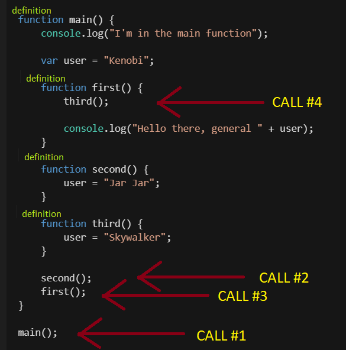

# How to Javascript - LINUX or Windows Ubuntu Shell

---
## O - Before the first steps
All you will need is a Unix terminal and a text editor (VisualStudio, Notepad, whatever...).

On Windows, you will need setup `Windows WSL`, see :
https://itsfoss.com/install-bash-on-windows/

## I - Setting up your project
The first thing you will use is `npm` (which means `node packet manager`) which will surprisingly be managing the different packets you will install.

So, first thing to do is to open up a console and install it :

```shell
$> sudo apt-get install npm

$> npm -v
   1.2.3 (only to check if it is installed)
```

Once that is done, you should be able to run the starting setup with :
```
$> npm init
```

Now you should be able to key in certain types of data such as `ProjectName`, `Description` and `Author`. For the others, dont type anything, default values will do.

All of this will generate a `package.json` which acts as a configuration file for your application(s).

---
## II - Run your application/script

To do so, we will use `node` (on some machines, it's called `nodejs`) which is a Javascript runtime build (it runs Javascript code...). Now if you didn't change it, in your `package.json`, the **main** attribute should be `index.js`. This is the name of the source file that will be executed. Type this into your source file:

> console.log("Hello there");

Then run the project. This is done by giving `node` the path to the location of our `package.json` (NOT THE FILE ITSELF, the folder in which it's located !!!). If no argument is provided, the current directory is selected.

```shellP
$> node
 or
$> node /path/to/my/file/
```

This should print out `Hello there` to the console.

---
## III - Variables, objects, keys

Javascript is based around OOP which means `Object Oriented Programming`. In short, that means, you will be using and building objects that will interact with each other. In Javascript, these are defined between brackets : 

```js
{
    title: "General",
    name: "Kenobi",
    lightsabers: 1,
    arms: 2,
}
```

If you need to keep multiple variables in the same place, you can use an array :

```js
["Hello", "there", 1, 5, {title: "General"}, ["Obi", "Wan", {name: "Kenobi"}]]
```

Javascript doesn't give a damn about types, you can store anything in anything, and nest them however you want to.

Now for arrays, you access the values like this : 

```js
const data = ["Hello", "there", "General", "Kenobi"]

assert(data[0] == "Hello");

// Assert crashes the programm if the given condition is false. Usefull for debug !
```

> Values stored in the array are index based and start from 0.

For objects, you access the keys using a dot. You can also go "down" multiple levels into the object.

```js
const obj = {
    title: {
        name: "General",
        rank: 4
    },
    person: {
        name: "Kenobi",
        age: 42,
    }
};

assert(obj.person.name == "Kenobi");
```

There is no limit to this, only the tideness of your code could suffer from :
```js
console.log(this.is.a.deep.nested.variable.it.looks.ugly.in.your.code)
```

Last thing to note would be the different types of variable declarations.

> Const vs Var vs Let

When you declare a variable, you always place an identifier beforehand, like so :

```js
const someValue = 42;
let otherValue = 1337;
var anotherOne = 98;
```

The difference between them is their reusability.

`Const` values cannot be reassigned but you can change the contents of the value. Example :

```js
const data = {name: "Kenobi", title: "Commander"}

// You can do this 
data.title = "General"

// But you cannot do this
data = {name: "Cody", title: "Commander"}
```

`Let` values are the opposite, they are expected to change. So if you don't plan on the variable changing, use a const. Else, go for a `let`.

> Note, we don't talk about `var` because it's too vague and just means "it's a variable, you never know how it will work"

---
## IV - Functions

In Javascript, you will mostly be creating functions, be it inside objects or as a standalone. They take arguments as input where types don't matter and neither do their count. Case and point :

```js
function hello(first_arg, second_arg) {
    console.log("Hello ", first_arg);
    console.log("-> ", second_arg);

// The commented blocks are the output the function would give if run with the given arguments

hello("there", "General Kenobi");
/*
    $> Hello there
    $> -> General Kenobi
*/

hello("there");
/*
    $> Hello there
    $> -> undefined
*/

hello();
/*
    $> Hello undefined
    $> -> undefined
*/

hello("more", "arguments", "then", "expected");
/*
    $> Hello more
    $> -> arguments
*/

hello({key: "value", test: "ding"}, [1, 2, 3])
/*
    $> Hello {key: 'value', test: 'ding'}
    $> -> [1, 2, 3]
}
```

---
## V - Anonymous functions and scopes

One thing to know about functions in Javascript is that they can be considered as variables and thus passed as parameters.

```js
function greeter(name) {
    console.log("Hello " + name + " !");
}

function welcomeUser(username, func) {
    func(username);
}

welcomeUser("noob", greeter);

/*
    This would print out :

    $> Hello noob !
*/
```

To make this easier, JS has something called anonymous functions and they have a special syntax. They exist only where they are defined, usually directly given as an argument.

```js
function welcomeUser(username, func) {
    func(username);
}

welcomeUser("noob", (username) => { console.log("Hello " + username + " !")})

/*
    The precise syntax is the following : 
*/

    (arguments) => { function-content }
    
    // Can also be like this

    (arg1, arg2) => {
        console.log(arg1);
        console.log(arg2);
    }

    // OR (but this one is ugly)

    (arg1, arg2) => { console.log(arg1); console.log(arg2); console.log("Dont do this")}
```

Finally, you can declare functions inside objects. Or even inside other functions. But be carefull about variable names ! Case and point :

```js
function fourth() {
    user = "May";
}

function main() {
    console.log("I'm in the main function");

    var user = "Kenobi";

    function first() {
        third();

        console.log("Hello there, general " + user);
    }

    function second() {
        user = "Jar Jar";
    }

    function third() {
        user = "Skywalker";
    }

    second();
    first();
}

main();

// Try to guess what will be printed to the console !
```

If you didn't get it right, know this. When you declare a variable in a (function) scope, it is accessible in all the lower/contained scopes. That explains why the `user` variable that is declared in the `main()` function can be changed in the `second()` and `third()` functions.

Execution order is also important. It goes in an imperative order but do not mistake a function CALL and a function DEFINITION.



---
## VI - General Tips and usefull packages.

 - When in doubt about anything, use `console.log()` ! It can output anything... Seriously... Even functions... It helps alot when for some reason you were expecting an array and then realise your variable contains an object or some other weird stuff.

- Install `nodemon`. Every time you will change something in your files, you will need to stop and restart your `node` execution. Nodemon tracks your files and does it automatically for you.

- Your best friend is `lodash`. This library will handle ANYTHING you migt want to do with objects, arrays or others. Simple rule, if you can't do it with lodash, means you are doing it wrong...

> To install them, add them to your project using npm !

```shell
$> npm install nodemon lodash
```

## VII - Creating an Api.

Use `express`, duh...
